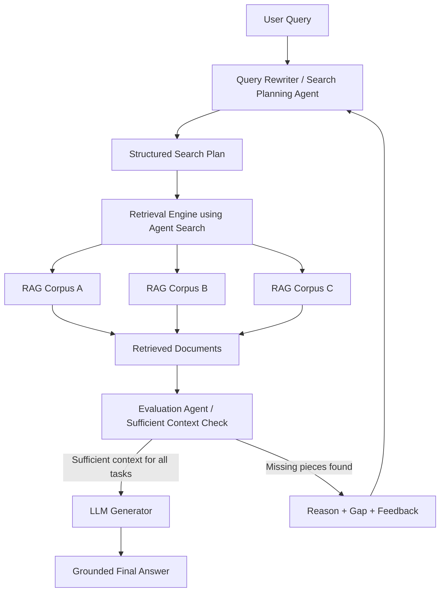

# Agentic RAG Cross-Corpus Retrieval

> **Status: implementation in progress.** The Agent Search retrieval layer and agent class scaffolding are in place. Agent LLM logic, prompts, and the orchestration pipeline are not yet implemented.

An **Agentic RAG** system built with **Google ADK v2.0** and **Agent Search**. Rather than searching one corpus once, the system plans searches across multiple corpora, evaluates whether the evidence is sufficient, and retries with refined queries when it isn't.

For a full technical walkthrough of the workflow, agent responsibilities, data schemas, and the evaluation loop, see [Architecture Documentation](docs/architecture.md).

---

## Architecture



---

## Repository structure

```text
.
├── docs/
│   ├── architecture.md                # Detailed workflow, schemas, and examples
│   └── devcontainer.md                # Dev-container guide
├── src/
│   ├── agents.py      # Agent class hierarchy
│   ├── logger.py      # Logging configuration
│   ├── prompts.py     # Prompt placeholders
│   ├── retrieval.py   # Agent Search / Discovery Engine (implemented)
│   ├── settings.py    # Pydantic settings
│   └── utils.py       # Auth + Discovery Engine client (implemented)
├── main.py            # Pipeline entry point (not yet implemented)
├── pyproject.toml
└── .env.example
```

---

## Setup

**Prerequisites:** Python 3.12+, [Poetry](https://python-poetry.org/), a Google Cloud service account with Agent Search access.

```sh
git clone <your-repository-url>
cd agent-rag-cross-corpus-retrieval
poetry install
cp .env.example .env   # then fill in credentials and config
```

Google ADK is not yet declared in `pyproject.toml`. Add it when the agent LLM integration is built:

```sh
poetry add 'google-adk>=2.0,<3.0'
```

Key `.env` variables:

```dotenv
GOOGLE_API_KEY=your_key_here
LLM=gemini-3.5-flash
PROJECT_ID=your-gcp-project-id
LOCATION=global
APP_ID=your-agent-search-app-id
CREDENTIALS_PATH=./credentials/your-service-account.json
```

---

## Using Google Developer Knowledge MCP with Claude Code / Codex

Configure the **Google Developer Knowledge MCP** at the project level (see `.mcp.json.example`) so that Claude Code or Codex can reference the official Google ADK v2.0 docs while editing this codebase. This reduces the risk of outdated ADK syntax, hallucinated APIs, and incorrect retrieval patterns.

---

## License

See [LICENSE](LICENSE).
