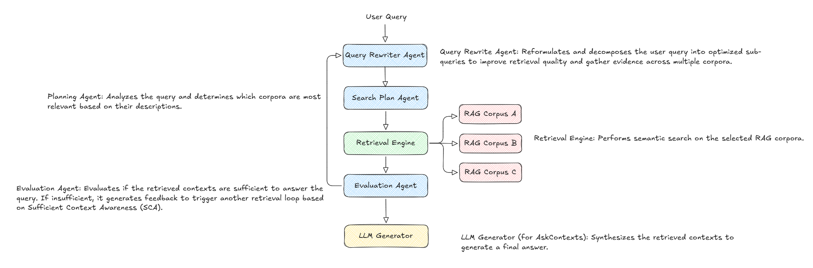
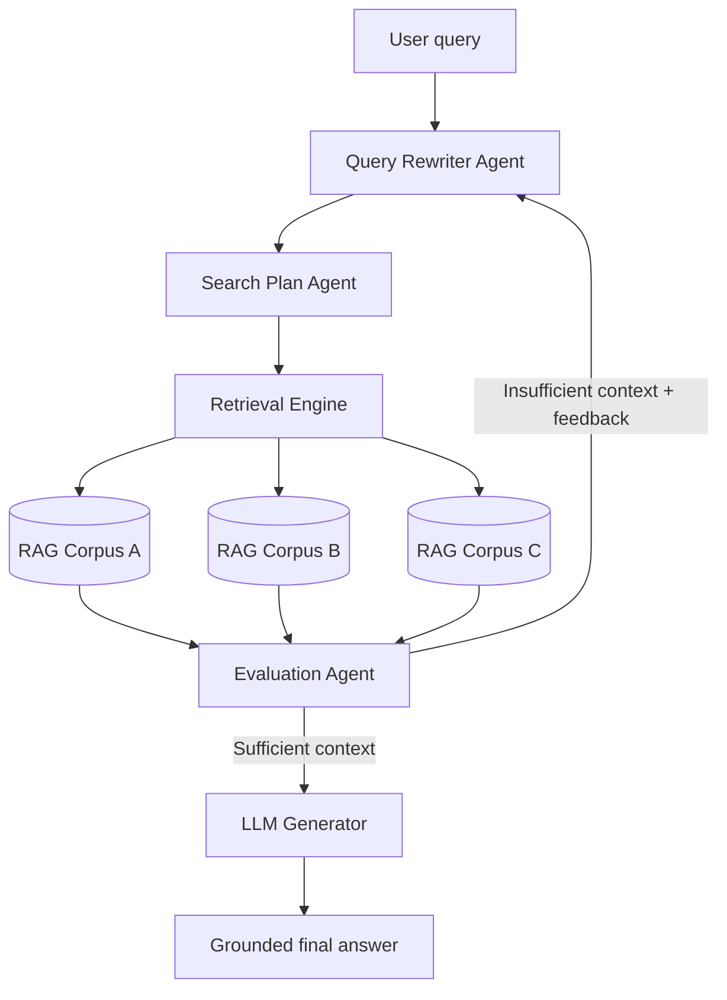

# Agentic RAG Cross-Corpus Retrieval

> **Project status: initial draft.** The repository currently contains the starting project structure and agent interfaces; the Google ADK workflow, retrieval connectors, prompts, and runnable pipeline have not been implemented yet.

This project is intended to implement an **Agentic Retrieval-Augmented Generation (RAG)** system with **Google ADK v2.0**. It follows Google's Cross-Corpus Retrieval / Agentic RAG pattern: instead of searching one knowledge base once and answering immediately, the system plans searches across multiple corpora, evaluates the evidence it retrieved, and iterates when more context is needed.

The goal is grounded answers to questions whose evidence may be spread across independent knowledge sources—for example, **RAG Corpus A**, **RAG Corpus B**, and **RAG Corpus C**.

## Architecture overview

The architecture below is the visual context for the intended implementation.

<!--  -->



## How the agents work

| Component | Responsibility |
| --- | --- |
| **Query Rewriter Agent** | Reformulates the user question and decomposes it into precise, retrieval-friendly sub-queries. This broadens coverage and makes it easier to gather evidence from different corpora. |
| **Search Plan Agent** | Examines the rewritten queries and corpus descriptions, then selects the corpora and search strategy most likely to yield relevant evidence. |
| **Retrieval Engine** | Runs semantic search against the selected corpora and returns relevant passages with source metadata. |
| **Evaluation Agent** | Applies *Sufficient Context Awareness*: it checks whether the retrieved evidence is complete, relevant, and strong enough to answer the original question. It prevents premature answer generation. |
| **LLM Generator** | Produces a final, grounded answer from the evaluated contexts, ideally preserving citations or source references. |

## Retrieval loop

The system is designed to retrieve deliberately rather than treat the first search result as final:

1. **Query rewriting**: Turn the original question into optimized sub-queries.
2. **Search planning**: Choose the best corpus or combination of corpora for each sub-query.
3. **Retrieval**: Perform semantic search over the selected knowledge sources.
4. **Context evaluation**: Decide whether the collected evidence answers the question adequately.
5. **Retry when insufficient**: Feed the evaluator's gap analysis into another retrieval loop.
6. **Final generation**: Generate only after the evaluation agent finds the context sufficient.

This loop is especially useful for **cross-corpus retrieval**, where no single source contains a complete answer. The evaluation agent is the guardrail that stops the system from generating an answer too early when important evidence is missing or conflicting.

## Current repository structure

```text
.
├── docs/
│   ├── agentic_rag_architecture.png  # Architecture context used above
│   └── devcontainer.md               # Development-container guide
├── src/
│   ├── agents.py                     # Draft agent interfaces
│   ├── logger.py                     # Logging configuration
│   ├── prompts.py                    # Prompt placeholders
│   └── settings.py                   # Pydantic settings scaffold
├── main.py                           # Planned pipeline entry point (currently empty)
├── pyproject.toml                    # Poetry configuration
└── .env.example                      # Environment-variable template (currently empty)
```

## Setup

### Prerequisites

- Python 3.12+
- [Poetry](https://python-poetry.org/)
- A Google AI / Google Cloud credential appropriate for the Google ADK model and retrieval services you plan to use
- Optional: Docker Desktop and VS Code Dev Containers; see the [Dev Container guide](docs/devcontainer.md)

### Install the project

```sh
git clone <your-repository-url>
cd agent-rag-cross-corpus-retrieval
poetry install
```

Google ADK is not yet declared in `pyproject.toml`, because this is an initial draft. When implementation begins, add the Google ADK v2.0 dependency and lock it intentionally:

```sh
poetry add 'google-adk>=2.0,<3.0'
poetry lock
```

### Configure environment variables

Copy the template and add the credentials and model settings required by your chosen Google ADK deployment:

```sh
cp .env.example .env
```

Suggested starting values:

```dotenv
# Required credential variable depends on the selected Google ADK provider.
GOOGLE_API_KEY=your_key_here

# Read by src/settings.py; defaults to gemini-3.5-flash if omitted.
LLM=gemini-3.5-flash
```

Keep `.env` out of version control. When retrieval backends are added, define their connection details here as well—for example, corpus IDs, project/location, and vector-store credentials.

## Example usage (target interface)

The runnable orchestration has not been implemented yet. The intended command-line experience is:

```sh
poetry run python main.py "Compare the security controls in Corpus A with the deployment guidance in Corpus B."
```

At runtime, the pipeline should rewrite the query, plan a cross-corpus search, retrieve evidence, evaluate sufficiency, retry if necessary, and finally return a source-grounded response.

## Implementation roadmap

- Add Google ADK v2.0 and model-provider configuration.
- Implement the query rewriter, search planner, evaluator, and generator agents in `src/agents.py`.
- Define structured input/output schemas and prompts in `src/prompts.py`.
- Connect semantic retrieval backends and register corpus descriptions.
- Implement retry limits, evaluator feedback, observability, citations, and tests.
- Wire the end-to-end workflow into `main.py`.

## Using Google Developer Knowledge MCP with Codex

It is recommended to configure the **Google Developer Knowledge MCP** at the **project level** when working on this repository. That gives Codex access to the latest official Google ADK documentation and examples while it edits the code.

This is particularly valuable while the implementation is being built: ADK APIs and recommended patterns can evolve, and the MCP-backed documentation helps avoid outdated ADK usage, hallucinated APIs, and incorrect implementation patterns. Use it to verify agent construction, orchestration, tool integration, and the current Google-recommended retrieval approach before committing implementation changes.

## License

See [LICENSE](LICENSE).
